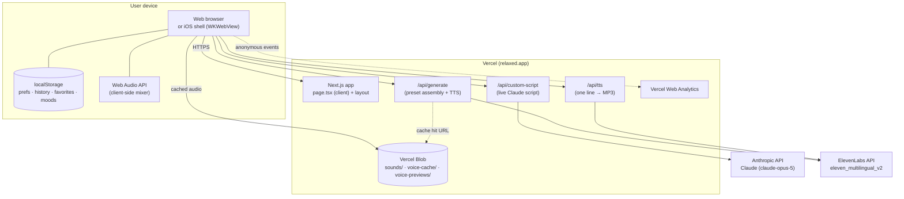
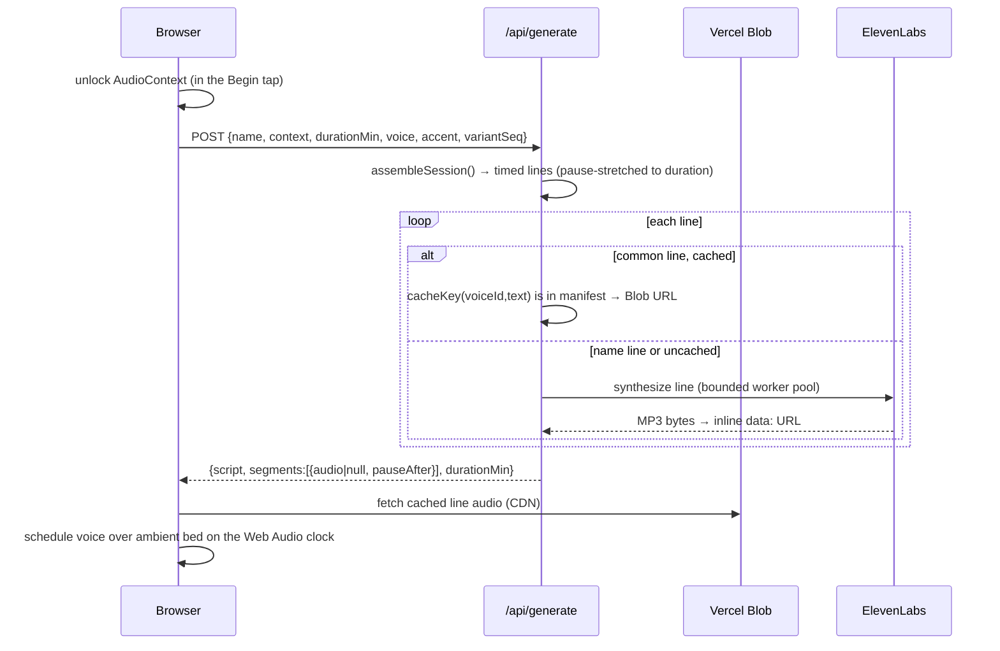

# Architecture

> System design, component boundaries, and request lifecycles for relaxed.app.
> For the audio engine internals see [audio-engine.md](./audio-engine.md); for
> hosting and environments see [infrastructure.md](./infrastructure.md).

## 1. One-paragraph summary

relaxed.app is a **Next.js 14 (App Router) application** deployed on **Vercel**,
delivered on the web and wrapped for iOS by a **thin Capacitor shell** that loads
the hosted site in a WKWebView. The entire user experience is a single React
client component; the server side is three stateless API routes that call two AI
providers, **Anthropic (Claude)** to write meditation scripts and **ElevenLabs**
to voice them. There is no application database and no user accounts: all
per-user state lives in the browser's `localStorage`. Pre-rendered voice lines
and soundscape audio are served as static files from **Vercel Blob**. A second
brand, ElevenMind, is produced from the same codebase by a build-time flag.

## 2. System context



**Trust boundaries.** API keys for Anthropic and ElevenLabs live only in Vercel
server environment variables and are used only inside the API routes; they are
never shipped to the browser. Everything the browser holds (prefs, history) stays
on the device. See [security.md](./security.md) and [data-privacy.md](./data-privacy.md).

## 3. Component inventory

| Layer | Component | File(s) | Responsibility |
|---|---|---|---|
| Client UI | `Home()` | `app/page.tsx` (~2,580 lines) | The entire experience: a five-screen state machine (setup → history → generating → player → complete). |
| Client audio | `class AudioEngine` | `app/page.tsx:283` | Web Audio mixer: voice bus, ambient bed, ducking, bloom, bells, streaming playback, loudness normalization. |
| Server | `/api/generate` | `app/api/generate/route.ts` | Assembles a preset session from templates and voices it (cache-first, ElevenLabs for the rest). |
| Server | `/api/custom-script` | `app/api/custom-script/route.ts` | Writes a bespoke session live with Claude from the user's typed phrase. |
| Server | `/api/tts` | `app/api/tts/route.ts` | Voices a single line on demand (powers custom streaming). |
| Content | Session templates | `lib/sessions.ts`, `lib/sessionScripts.json` | 5 intentions × 3 script variants; pacing/duration assembly. |
| Content | Contexts + prompt | `lib/contexts.ts` | Intentions, durations, the Claude system prompt, feature flags. |
| Content | Meditation Engine | `lib/engine.ts` | Session blueprint (scene arc + per-scene targets) driving the custom path, and the per-intention audio envelope (scene-based mix). See [audio-engine.md](./audio-engine.md#9-the-meditation-engine-phase-1). |
| Infra libs | Voice cache | `lib/voiceCache.ts`, `lib/voiceCacheManifest.json` | Hash-keyed cache of pre-voiced common lines (1,448 entries). |
| Infra libs | Asset resolver | `lib/assets.ts` | Prefixes static audio paths with the Blob base URL in production. |
| Infra libs | TTS helper | `lib/tts.ts` | Voice-ID resolution + ElevenLabs byte synthesis. |
| Identity | Brand fork | `lib/brand.ts` | Chooses ElevenMind vs relaxed at build time from `NEXT_PUBLIC_BRAND`. |
| Identity | Marks/motifs | `lib/mark.tsx`, `lib/soundMotifs.tsx`, `lib/iconArt.ts` | Stem mark, orbit glyph, per-soundscape line motifs, icon/OG art. |
| Client state | History | `lib/history.ts` | On-device recent (last 10) + favorites + mood log. |
| Client state | Analytics | `lib/analytics.ts` | Anonymous first-party product events. |
| Native bridge | Capacitor | `lib/native.ts`, `capacitor.config.ts` | Haptics + lock-screen Now Playing; safe no-ops on the web. |

## 4. Key architectural decisions

1. **Single-page client component, screen state machine.** The whole app is one
   client component that swaps a `screen` value (`setup | history | generating |
   player | complete`). The screen subtree is keyed on `screen` so it remounts
   and re-fires the calm fade-in on each transition, while audio and session
   state live in refs/hooks on the parent and survive the remount
   (`app/page.tsx:2345`). This keeps the always-on `AudioContext` and playback
   timeline intact across view changes.

2. **No database, no accounts (yet).** All personalization state is
   `localStorage` on the one device. This is a deliberate privacy and
   time-to-market choice; cross-device continuity is a Phase 2 item that would
   add an accounts backend. See [data-privacy.md](./data-privacy.md) and
   [risks-tech-debt.md](./risks-tech-debt.md).

3. **Cache-first voice for presets.** Preset sessions reuse a large set of
   pre-voiced lines from Vercel Blob and only synthesize the personalized name
   line (and any not-yet-cached line) live. This makes presets nearly free and
   fast; only the bespoke "In your words" path pays for a full live generation.

4. **Instant start for the bespoke path.** Rather than a 10–40s "composing"
   wait, the custom path plays a fixed spoken **arrival** immediately while
   Claude writes the **body** in parallel; the body streams line-by-line onto
   the same audio timeline. See the sequence diagrams below.

5. **Client-owned timing.** Meditations are mostly silence. ElevenLabs cannot
   render long pauses economically, so the app schedules real silence between
   spoken lines on the Web Audio clock, with the ambient bed continuing. The app
   owns timing; Claude owns language; ElevenLabs owns voice.

6. **Thin native shell.** iOS is a Capacitor WKWebView pointing at
   `https://relaxed.app`, so web changes reach installed apps immediately and
   only genuinely native concerns (launch screen, haptics, lock-screen,
   background audio) require an App Store build. See [ios-native.md](./ios-native.md).

7. **One codebase, two brands.** `NEXT_PUBLIC_BRAND` selects identity at build
   time so ElevenMind (the ElevenLabs demo) and relaxed.app deploy from the same
   source without runtime cost. See [design-system.md](./design-system.md).

## 5. Request lifecycles

### 5a. Preset session (e.g. Meditate · 10 min · Her · US · Rain)



### 5b. Custom "In your words" session (instant start)

```mermaid
sequenceDiagram
    participant U as Browser
    participant C as /api/custom-script
    participant A as Anthropic (Claude)
    participant T as /api/tts
    participant E as ElevenLabs
    U->>U: Begin → player immediately; bed + breathing orb start
    par Arrival (immediate)
        U->>T: POST each fixed arrival line
        T->>E: synthesize
        E-->>T: MP3
        T-->>U: MP3 → play, duck bed under each line
    and Body (in parallel)
        U->>C: POST {name, phrase, durationMin, leadSeconds, arrivalText}
        C->>A: buildPrompt() + SCRIPT_SYSTEM_PROMPT
        A-->>C: script with <break> pause tags
        C->>C: parseBreaks() + fitToDuration(minus leadSeconds)
        C-->>U: {segments:[{text, pauseAfter}]}
    end
    U->>T: stream body line-by-line (concurrency 3)
    T->>E: synthesize each
    E-->>U: MP3 → schedule onto the same timeline after the arrival
    Note over U: closing bell; on empty body, degrade to sounds-only
```

### 5c. Sounds-only session (voice = none)

Client skips both AI providers entirely and plays the chosen soundscape bed with
the breathing orb; the bed is level-matched at the solo target. No network call
to Anthropic or ElevenLabs.

## 6. Preview / degraded modes (no keys, or provider down)

The app is designed to always produce a coherent session:

- **No `ANTHROPIC_API_KEY`:** `/api/custom-script` returns a hardcoded generic
  "fallback" script (`mock: true`) so the custom flow still demonstrates.
- **No `ELEVENLABS_API_KEY`:** `/api/generate` returns the script text with
  `audio: null` segments (`mock: true`); the session plays as guided silence
  over the bed, with a "preview mode" note. `/api/tts` returns `503` and the
  client treats that line as silence.
- **Provider error mid-session:** per-line TTS failures fall back to silence for
  that line (the pause is preserved); an empty custom body degrades to a
  sounds-only session and emits a `custom_no_body` analytics event.

## 7. What the architecture deliberately does not include

- No server-side session store, queue, or worker fleet (all synthesis is
  request-scoped inside serverless functions).
- No client state manager (Redux/Zustand); React `useState`/`useRef` only.
- No CSS framework; hand-authored CSS with custom properties.
- No ORM/database.
- No automated test suite yet (see [risks-tech-debt.md](./risks-tech-debt.md)).
