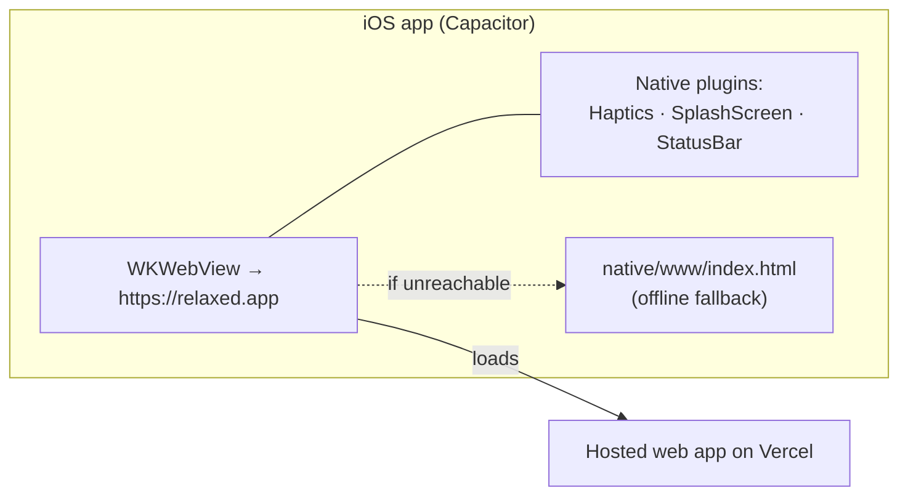

# iOS & Native

> How the iOS app relates to the web app, what is genuinely native, and when a new
> App Store build is required. The step-by-step build & submission procedure is in
> [ios-build.md](./ios-build.md); native config is `capacitor.config.ts`.

## 1. The model: a thin shell over the hosted site

The iOS app is a **Capacitor 8.5 WKWebView** that loads `https://relaxed.app`. All
product logic — the script (Claude), the voice (ElevenLabs), the audio engine, the
UI — runs in the hosted web app. Consequences:

- **Web changes ship instantly** to installed apps via a normal Vercel deploy; no
  App Store round-trip.
- **A new App Store build is required only for native concerns:** the launch
  screen, the app icon, `capacitor.config.ts`, `Info.plist` capabilities, and
  native plugins (haptics, splash, status bar).
- If `relaxed.app` is unreachable, the app shows a minimal offline fallback
  (`native/www/index.html`): an Ink/Bone page with the stem mark and "You're
  offline. Reconnect when you're ready, and your session will begin." (safe-area
  padded so it clears the notch and home indicator).

## 2. Native configuration (`capacitor.config.ts`)

- `appId: app.relaxed`, `appName: relaxed`, `server.url: https://relaxed.app`,
  `cleartext: false`.
- `backgroundColor: #121110` (Ink) app-wide and iOS, so the status-bar and
  home-indicator regions are painted by the native Ink ground.
- **Safe-area insets have exactly one owner per runtime.** In the iOS shell the
  native WKWebView insets the content by the safe area (`ios.contentInset: "always"`
  in `capacitor.config.ts`) and the Ink page background fills the status-bar /
  Dynamic Island / home-indicator regions. On the hosted site in mobile Safari
  there is no native inset, so the *page* owns it: `viewport-fit=cover` makes the
  `env(safe-area-inset-*)` values real and the chrome clears the notch via CSS
  padding (`.topbar`, `.player-top`, the tray/history bottoms).
  - **The two must never both apply, or they double up** and the whole layout is
    pushed down (the player header floats far below the island). So the CSS reads
    its insets from `--sat`/`--sab` tokens, which default to `env(...)` but are
    **zeroed inside the iOS shell** (`html[data-native-ios]` in `app/globals.css`).
    The `data-native-ios` flag is set synchronously before first paint by a tiny
    inline script in `app/layout.tsx` that checks `Capacitor.getPlatform() === "ios"`.
  - This was a latent double-inset bug (both sides insetting). The fix lives
    **entirely web-side**, so it reaches every installed build the moment it
    deploys — no native rebuild. Keep `contentInset: "always"` and the token
    override in sync: if one ever changes, the other must too.
- **SplashScreen:** `launchShowDuration 1500`, `launchFadeOutDuration 700`, Ink
  background, no spinner — a calm cross-fade into the hosted page over an unchanging
  Ink ground.
- **StatusBar:** `style: DARK` (light text/icons on the Ink ground). Also set in
  Info.plist so it applies without a JS call on the remote page.
- **LocalNotifications** (`@capacitor/local-notifications`): powers the daily
  practice reminder. The reminder is scheduled entirely on-device (a repeating
  local notification at the user's chosen time), no server or push tokens. The web
  layer resolves the plugin at runtime through the bridge (like Haptics), so it is
  only present in an app build that compiled the dependency in (a `cap sync`
  landing in **1.2**). **The reminder UI is native-only:** the top-right bell and
  its sheet render only where a notification can actually be scheduled
  (`notificationsAvailable()`, resolved after mount), so they are hidden on the web
  (no on-device scheduler there, and the pref wouldn't sync to the phone anyway)
  and on pre-1.2 builds. The feature simply appears once 1.2 is installed; there is
  deliberately no "saved but won't fire yet" messaging. **Permission is requested
  in context:** iOS shows its system prompt when the user turns the reminder on
  (`toggleReminder` → `saveReminder(pref, prompt=true)`), and again when they
  reopen the bell on an already-enabled reminder (`openReminder` re-applies via
  `saveReminder(pref, prompt=true)`, which shows the prompt only while the status
  is undetermined **and schedules the notification once granted** — requesting
  alone left an allowed reminder unscheduled). This closes the gap where a
  reminder could be on but was never actually asked for permission, so it could
  never fire. The toggle reflects the user's **intent** (it flips on and persists
  immediately, never a dead switch); the sheet then shows honest status — "we'll
  nudge you at HH:MM" when scheduled, or a "turn on notifications in Settings"
  hint if permission was denied (iOS only prompts once, so a denied reminder is
  recovered from Settings). The notification **title is brand-aware** ("relaxed"
  vs "ElevenMind", never one brand's name on the other), and the **body rotates**
  through a few gentle lines, greeting the user by name when one is saved
  on-device (`reminderBody()`; the name never leaves the device).
  (`lib/reminders.ts` `applyReminder` returns `{ scheduled, blocked }` alongside
  the persisted pref.)

## 3. Native capabilities in use

| Capability | How | Notes |
|---|---|---|
| Background audio | `Info.plist` `UIBackgroundModes: [audio]` + the web app's `audioSession` handling | Sessions keep playing when the screen locks. Needs iOS 16.4+ to also override the mute switch. |
| Lock-screen / Now Playing | Web `MediaSession` (`lib/native.ts`) with per-soundscape artwork from `/artwork` | Play/pause/stop; seek/prev/next handlers are deliberately cleared (a meditation isn't scrubbable). |
| Haptics | `@capacitor/haptics`, resolved on the remote page via `registerPlugin` (`lib/native.ts`); web fallback is `navigator.vibrate` | Light/medium/heavy/success at begin, controls, feedback, completion. |
| Launch screen | `assets/splash*.png` baked with the beveled "r" | Launch images do not receive iOS 26's live icon bevel, so it is baked in. |
| App icon | `assets/icon.png` (flat) | iOS 26 applies the live "Liquid Glass" bevel at render time. |

## 4. Asset generation

`npm run ios:assets` (`@capacitor/assets`) generates every native icon and launch
size from `assets/icon.png` (1024²) and `assets/splash.png` / `splash-dark.png`
(2732²). `npm run ios:sync` (`cap sync ios`) copies web assets and **registers
native plugins** — skipping it is why an earlier build shipped without working
haptics/splash. Always run both before archiving.

## 5. When you need a new build (decision guide)

| Change | New App Store build? |
|---|---|
| Any UI/logic/audio/content in the web app | **No** — deploy to Vercel |
| App icon or launch screen | Yes |
| `capacitor.config.ts` or `Info.plist` | Yes |
| Add/upgrade a native plugin | Yes |
| New voice, soundscape, or pricing copy | No |

## 6. Release process (summary)

On a Mac: `npm install` → `npx cap add ios` (first time) → `npm run ios:assets` →
`npm run ios:sync` → make the three Info.plist edits → set signing/team, Bundle ID
`app.relaxed`, min iOS 16.4 → Product ▸ Archive ▸ Distribute ▸ App Store Connect →
fill metadata → Submit. Full detail, including App Store Connect fields and the
Guideline 4.2 "minimum functionality" review-notes guidance, is in
[ios-build.md](./ios-build.md).

## 7. Known native gotchas

- **Launch-screen cache:** iOS aggressively caches the launch image; to verify a
  new splash, delete the app, restart the phone, and reinstall.
- **Run both `ios:assets` and `ios:sync`** before every archive, or native assets
  and plugins won't be in the binary.
- **Guideline 4.2:** a web-wrapper app risks rejection; submission notes should
  emphasize the real-time generated audio and background playback.
