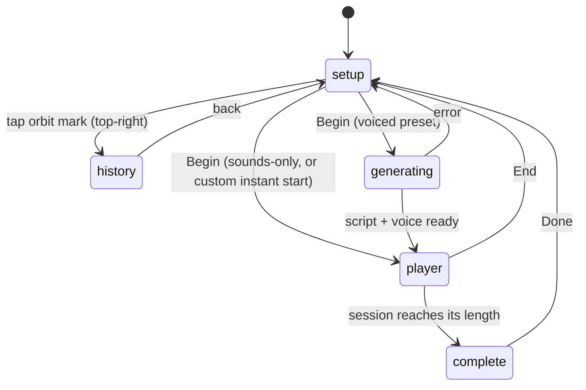

# Product Specification

> What the product does, screen by screen and choice by choice. Implementation
> lives in `app/page.tsx` (UI) and [audio-engine.md](./audio-engine.md) (playback).

## 1. Core concept

Every session is generated for the individual: their name, what they need, how
long, and which voice, plus (for the bespoke path) a short phrase in their own
words. There is no fixed catalog to browse; the product's promise is "tell relaxed
what you need and it makes one for you."

## 2. The choices a user makes

| Choice | Options | Default | Source |
|---|---|---|---|
| Intention | meditate, sleep, flow, relax, and either "In your words" (relaxed) or "breathe"/stress-relief | meditation | `lib/contexts.ts` |
| Duration | 5, 10, 15, 20, 30 minutes | 10 | `DURATIONS` |
| Voice | Her, Him, or None (sounds only) | Her | `VoiceChoice` |
| Accent | US, UK | US | `Accent` |
| Soundscape | 15 across Nature / Music / Frequencies | rain (first-time) | `SOUNDSCAPES` |
| Name | free text (≤40 chars, on-device only) | empty | `PREFS` |
| Phrase (custom only) | free text (≤70 chars) | — | custom input |

### Soundscapes (15)

- **Nature:** Rain, Ocean Waves, Wind, Thunderstorm, Windchimes.
- **Music:** Ambient, Piano, LoFi, Singing Bowls, Harp.
- **Frequencies:** Brown Noise, 432 Hz, Binaural, Delta, Theta (ElevenLabs
  recordings, like the other families).

Each soundscape also has a bespoke **line motif** that animates inside the player's
breathing ring (`lib/soundMotifs.tsx`).

## 3. Screen flow

The app is a five-state machine: **setup → history → generating → player →
complete** (see [architecture.md](./architecture.md#4-key-architectural-decisions)).

### 3a. Setup (home)

- **Header (the name is an editable part of the headline, never a standing box).**
  First run shows "what should we call you?" with a name field; once a name is set
  (or remembered), the header becomes the time-based greeting with the name inline
  and a small pencil to tap and edit ("good evening, Chris ✎"). ElevenMind keeps
  its original greeting + name field.
- **The flagship ("In your words").** On relaxed, under "What would you like to
  do?", "make your own" is a filled (Bone) primary card ("Let us create a
  personalized, guided session for whatever you need."), set apart above an
  "or pick a common intention" divider.
- The common intentions (meditate, sleep, flow, relax) follow as quiet rows.
  Tapping any option (including make your own) opens the options tray.
- An **orbit-mark entry point** (top-right) appears once the user has any history,
  opening the History screen.

### 3b. Options tray (onboarding as ritual)

- Exposes voice (Her/Him/None), accent (US/UK), duration, soundscape (by family
  tab), a "remember me" switch, and Begin.
- **First-time users** get a clean slate: Nature tab, nothing preselected;
  the first tap both selects and auditions. A rain bed always sits underneath, so
  Begin works even if the user never customizes.
- **Returning users** see their remembered voice, accent, and soundscape
  prepopulated as active selections.
- **Previews:** tapping a voice plays a short cached greeting clip in that
  voice/accent; tapping a soundscape auditions a few seconds of that bed
  (level-matched, fades in/out). Auditions stop when the tray closes.

### 3c. Generating (voiced presets only)

A brief "composing your session" beat with progress steps, while `/api/generate`
returns the script and audio. Sounds-only and custom instant-start skip this
screen and go straight to the player.

### 3d. Player

- A breathing orb synced to the breath cue ("Breathe in / Hold / Breathe out"),
  a per-soundscape line motif in the ring, a karaoke-style transcript that
  highlights the active line, and play/pause/end controls.
- The session timer is wall-clock based, so it stays correct across the screen
  locking or the app backgrounding.
- Lock-screen / Now Playing controls (native app) with per-soundscape artwork.

### 3e. Complete

- A closing screen with a one-tap "How do you feel?" micro-feedback (much calmer /
  a little calmer / about the same), stored on-device. Done returns home.

### 3f. History

Titled "your sessions", reached from the orbit mark (top-right of the home),
which appears once there is any history. The first time it appears (typically
after the first completed session), it pulses a few times with a small "history
and saved" tooltip to introduce it, once ever (a one-time on-device flag). Two
groups, **saved on top, then recent**:

- **saved:** starred sessions, kept indefinitely (they do not roll off the way
  recent does; the store caps at 100). Star from any recent row; a saved session
  shows only under Saved so it never appears twice.
- **recent:** the rolling last 10 sessions, reverse-chronological, each showing
  intention/phrase, time-ago, and detail (`length · Her/Him · US/UK · soundscape`,
  or `length · sounds only`). Tap to replay (restores every choice and opens the
  tray).

Any row **swipes left to reveal a delete action** (a trash button); tapping it
removes that session, tapping the card or swiping back closes it. Because relaxed
locks the page (single-screen shell), the list is its own inner scroller: the
back-button bar stays fixed while the sessions scroll, so a long saved list stays
fully reachable. All history is on-device (`localStorage`); see
[data-privacy.md](./data-privacy.md).

## 4. Personalization pipeline (user's view)

1. The user's choices shape which template or prompt is used.
2. For presets, a template is assembled and pace-stretched to the chosen length;
   the name line is voiced live, the rest reused from cache.
3. For "In your words," the **Meditation Engine** gives Claude a structured arc
   (settle → body → visualization → reflection → close) with per-scene targets;
   Claude fills each scene, and it starts instantly with a spoken arrival while
   the body streams in.
4. Everything plays over the chosen bed with ducking, a bloom-in, soft bells, and
   a **scene-based audio envelope**: for sleep the voice thins out toward the end
   while the bed continues; other sessions soften gently at the close.

Technical detail: [audio-engine.md](./audio-engine.md).

## 5. Preview mode (no keys)

With no API keys the app still demonstrates end-to-end: presets play as guided
silence over the bed with the script on screen; the custom path uses a generic
fallback script. This makes the product fully explorable before spending on
providers. See [architecture.md](./architecture.md#6-preview--degraded-modes-no-keys-or-provider-down).

## 6. Explicitly not built (product decisions)

Streaks, social features, public profiles, leaderboards, notification spam, and
"AI-powered" gimmicks are deliberately excluded as off-brand for a luxury-object
positioning. See [roadmap.md](./roadmap.md#explicitly-not-building).

## 7. Quality assurance

There is no automated test suite; QA is manual. The Phase 0 QA checklist used for
the last major release is preserved at [qa-phase0.md](./qa-phase0.md). This is a
known gap, tracked in [risks-tech-debt.md](./risks-tech-debt.md#testing).
